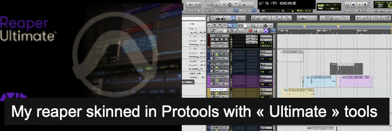

<h2 align="center"><em>What if REAPER had the tools of Pro Tools?</em></h2>

<h3 align="center"><em>"Reapers" by Muse is a reference among all</em></h3>

# Scripts Reaper inspired from Protools and more - by Mariow
## Installation via ReaPack

Add this URL to your Reapack repositories (Reapack>Manage Repositories... import/export) to install these Scripts
https://github.com/Geeksound/Reaper_Scripts-Mariow/raw/main/index.xml

## Directory Structure
- `View/`: Scripts related to display
- `Editing/`: Scripts for editing
- `Utility/`: Utility scripts
- `Metadatas/`: Scripts related to metadata

-------------------------------------------------
- `View/`---------

## 1. **Interactive-TC-Display** (ReaImGui)
(https://github.com/Geeksound/Reaper_Scripts-Mariow/blob/main/View/Interactive-TC-Display.lua)  
 Displays either the Timecode or the selected item's name dynamically, based on context.
 Designed for precise visual feedback in post-production or recording workflows.

<!--### Overview of the 'TimeCode' field depending on the context
-->

  

   

ReaImGui script for REAPER that displays contextual time information in a clean and readable floating window.

### FEATURES
- **Displays the name and timecode** of selected Items (hh:mm:ss:ff)
- **Displays the duration** of the timeselection (if no item is selected)
- **Shows the play cursor or playback position** with large text
- **Dynamic display** :
- `Play` when Reaper is playing
- `REC` when Recording
- `Position` when stopped
- **Colored background** :
- Black by default
- Green during playback
- Red while recording
- **custom typography** : Comic Sans MS for a playful touch
- 
### Dependancy

This script requires [ReaImGui](https://github.com/cfillion/reaimgui).

### Installation via ReaPack

Add this repository to your ReaPack:

-------------------------------------------------
- `Editing/`---------

## 1. **TimeShift** 
(https://github.com/Geeksound/Reaper_Scripts-Mariow/blob/main/Editing/TimeShift.lua)  
 Precise Time Shifting (ReaImGui)
 ReaImGui script for REAPER that allows precise shifting of items, time selection, or the edit cursor using a user-defined value in various formats.
 This script is inspired by the Edit/Shift function in PROTOOLS, with added improvements.

<!-- ancienne version non centree pour reference
### Overview of 'TimeShift'
 -->

  

   

## FEATURES
- **Quick shifting** of selected items or time selection
- **Flexible input options** :
- **Timecode** (hh:mm:ss:ff)
- **Milliseconds**
- **Samples**
- **Automatic conversion** between formats
- **Interactive interface** using ReaImGui
- **Directional shifting** : forward or backward
- **Action buttons**  for instant application

## How to use

1. Choose whether to shift the Selected Item, the Time Selection, or the Edit Cursor.

2. Enter the desired offset value (e.g. 00:00:02:15, 1500 ms, or 44100 samples).

3. Click the appropriate button to shift forward or backward.

## Dependancy

- [ReaImGui](https://github.com/cfillion/reaimgui) (install via ReaPack)

---
## 2. **Swap-ItemsPositionsOnSameTracks**
 (https://github.com/Geeksound/Reaper_Scripts-Mariow/blob/main/Editing/Swap-ItemsPositionsOnSameTracks.lua)  
  Swap 2 Items on a Track for listening and editing purpose

 <!--### Overview of 'Swap-ItemsPositionsOnSameTracks'
-->

  

   

## FEATURES
 - **Quick comparative listening between 2 items
 - **Particularly useful during sound editing for picture

## How to use
 1. Select the 2 items you wish to swap positions.
 2. Run the Script

-------------------------------------------------
- `Utility/`---------

## 1. **CreateTracksFromText**
(https://github.com/Geeksound/Reaper_Scripts-Mariow/blob/main/Utility/CreateTracksFromText.lua)  
 Type a text and convert it in Reaper Session
 

<!--### Overview of 'CreateTracksFrom-Text'
-->

  

   

## FEATURES
 Write your Templates as a Text and transform this in a Reaper session as a Template would do

## How to use
 1. Write the appropriate form of Text and save the file
 2. Open the Script and Browse to your Text file and select it
 3. Your Tracks in Reaper are created

## CARE
 TEXT must be in PLAIN TEXT
 SHIFT(Cmd+T) in TextEdit
 or click on Format,then Make Plain Text.

-------------------------------------------------
- `Metadatas/`---------

## 1. **View-FieldRecorder-Metadatas**
(https://github.com/Geeksound/Reaper_Scripts-Mariow/blob/main/Metadatas/View-FieldRecorder-Metadatas.lua)  
This script allows you to read and analyze the metadatas of the selected item through its source file in a window. 
The metadatas being examined are that entered by Sound Recorders in Film Sound Recording, such as the Scorpio or Cantar,
in order to answer questions in this type of workflow.

  
-------------------------------------------------
-------About the Author-----
-------------------------------------------------
**[Geeksound](https://github.com/Geeksound)**
Sound engineer, professor, eternal student, and workflow designer.
Specialized in location and production sound, with a passion for developing innovative workflows.
Wish the best for Reaper, its collaborators and community.
