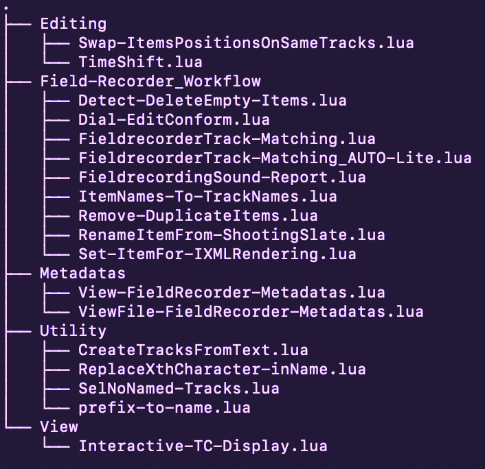

<h2 align="center"><em>What if REAPER had the tools of Pro Tools?</em></h2>

<h3 align="center"><em>"Reapers" by Muse is a reference among all</em></h3>

# Scripts Reaper inspired from Protools and more - by Mariow
## Installation via ReaPack

Add this URL to your Reapack repositories (Reapack>Manage Repositories... import/export) to install these Scripts  
https://github.com/Geeksound/Reaper_Scripts-Mariow/raw/main/index.xml

## D O C U M E N T A T I O N
`- Documentations/---------`
## **Documentations/\nRepository-Guide.lua**
Special Script to see and Download Guide for my Repository and Scripts

  

## Directory Structure
<h3><em>- 'DOCUMENTATIONS'</em></h3>
For better knowledge of Scripts &  
<h3 align="center"><em>FIELD RECORDING-TRACK GUIDE as in PROTOOLS</em></h3>

- `Editing/`: Scripts for editing
- `Field-Recorder_Workflow/`:  
Exclusive Scripts for Dialogue  
editing&conformation Inspired  
by "PT' Field-recorder Track
- `Metadatas/`: Scripts related to metadata
- `Utility/`: Utility scripts
- `View/`: Scripts related to display

  

-------------------------------------------------
`- Editing/---------`

## 1. **TimeShift** "PROTOOLS Edit/Shift in better" :)
(https://github.com/Geeksound/Reaper_Scripts-Mariow/blob/main/Editing/TimeShift.lua)  
Precise Time Shifting (ReaImGui)
ReaImGui script for REAPER that allows precise shifting of items, time selection, or the edit cursor using a user-defined value in various formats.
This script is inspired by the Edit/Shift function in PROTOOLS, with added improvements.

<!-- ancienne version non centree pour reference
### Overview of 'TimeShift'
 -->

  

   

## FEATURES
- **Quick shifting** of selected items or time selection
- **Flexible input options** :
- **Timecode** (hh:mm:ss:ff)
- **Milliseconds**
- **Samples**
- **Automatic conversion** between formats
- **Interactive interface** using ReaImGui
- **Directional shifting** : forward or backward
- **Action buttons**  for instant application

## How to use

1. Choose whether to shift the Selected Item, the Time Selection, or the Edit Cursor.


2. Enter the desired offset value (e.g. 00:00:02:15, 1500 ms, or 44100 samples).


3. Click the appropriate button to shift forward or backward.

## Dependancy

- [ReaImGui](https://github.com/cfillion/reaimgui) (install via ReaPack)

---
## 2. **Swap-ItemsPositionsOnSameTracks**
(https://github.com/Geeksound/Reaper_Scripts-Mariow/blob/main/Editing/Swap-ItemsPositionsOnSameTracks.lua)  
Swap 2 Items on a Track for listening and editing purpose

<!--### Overview of 'Swap-ItemsPositionsOnSameTracks'
-->

  

   

## FEATURES
- **Quick comparative listening between 2 items
- **Particularly useful during sound editing for picture

## How to use
1. Select the 2 items you wish to swap positions.
2. Run the Script

---
## 3. **SelNoNamed-Tracks**
(https://github.com/Geeksound/Reaper_Scripts-Mariow/blob/main/Utility/SelNoNamed-Tracks.lua)  
Select Tracks without Names or unnamed

  

   

-------------------------------------------------
`- Field-Recorder_Workflow/---------`

# --2 VERSIONS--  
of the Fieldrecorder-Track  
that everyone thought was  
exclusive to **PROTOOLS**
##  1.Full version with innovative Presets
##  2.Auto-mode version that will work on its own in most cases
ReaImGui scripts for REAPER that may be executed after an AAF import and match these .wav files imported with the Original RAW Files from the ****Fieldrecorder**

  

 

## 1. **FieldrecorderTrack-Matching_AUTO-Lite** "PROTOOLS Fieldrecorder Track" with an **AUTOMATIC-MODE!**:)
(https://github.com/Geeksound/Reaper_Scripts-Mariow/blob/mainField-Recorder_Workflow/FieldrecorderTrack-Matching_AUTO-Lite.lua)  

## 2. **FieldrecorderTrack-Matching** "PROTOOLS Fieldrecorder Track" with some presets accorded to  **Fieldrecorders**:)
(https://github.com/Geeksound/Reaper_Scripts-Mariow/blob/mainField-Recorder_Workflow/FieldrecorderTrack-Matching.lua)  

  

 

## 3. **Dial-EditConform** comes after RAW Files Matching to explode and organize Itemsin Tracks by Name
(https://github.com/Geeksound/Reaper_Scripts-Mariow/blob/mainField-Recorder_Workflow/Dial-EditConform.lua)  

  

 

## Utilities
## 1. **RenameItemFrom-ShootingSlate**
(https://github.com/Geeksound/Reaper_Scripts-Mariow/blob/main/Field-Recorder_Workflow/RenameItemFrom-ShootingSlate.lua)  
This script Rename Items with the SCENE/Take and/or TRACK NAME edited during Shooting on the FIELD RECORDER 
May be useful for Post-production editing Dialogues

  

 

## 2. **ItemNames-To-TrackNames**
(https://github.com/Geeksound/Reaper_Scripts-Mariow/blob/main/Field-Recorder_Workflow/ItemNames-To-TrackNames.lua)  
This script Rename the Track from item selected.
May be useful for Post-production editing tasks and other.

  

 

## 3. **Remove-DuplicatesItems**
(https://github.com/Geeksound/Reaper_Scripts-Mariow/blob/main/Field-Recorder_Workflow/Remove-DuplicateItems.lua)   
This script delete the unnecessary duplicates Items that are imported  
when Matching Raw Files with AAFs during conformation.  
Very useful when editing dialog.

  

 

## 4. **Detect-DeleteEmpty-Items**
(https://github.com/Geeksound/Reaper_Scripts-Mariow/blob/main/Field-Recorder_Workflow/Detect-DeleteEmpty-Items.lua)   
This script delete the empty Items that sometimes are recorded  
on a Field Recorder when track as no input but is ARMED.
-- Dont't worry , ROOM TONES won't be deleted :) ! --

-------------------------------------------------
`- Metadatas/---------`

## 1. **View-FieldRecorder-Metadatas**
(https://github.com/Geeksound/Reaper_Scripts-Mariow/blob/main/Metadatas/View-FieldRecorder-Metadatas.lua)  
This script allows you to read and analyze the metadatas of the selected item through its source file in a window. 
The metadatas being examined are that entered by Sound Recorders in Film Sound Recording, such as the Scorpio or Cantar,
in order to answer questions in this type of workflow.

## 2. **ViewFile-FieldRecorder-Metadatas**
(https://github.com/Geeksound/Reaper_Scripts-Mariow/blob/main/Metadatas/ViewFile-FieldRecorder-Metadatas.lua)  
This script allows you to read and analyze the metadata of an audiofile in the browser.  
It may be useful for Conformation and Dialogue Editing duties.

  

   

-------------------------------------------------
`- Utility/---------`

## 1. **CreateTracksFromText**
(https://github.com/Geeksound/Reaper_Scripts-Mariow/blob/main/Utility/CreateTracksFromText.lua)  
 Type a text and convert it in Reaper Session
 

<!--### Overview of 'CreateTracksFrom-Text'
-->

  

   

## FEATURES
 Write your Templates as a Text and transform this in a Reaper session as a Template would do

## How to use
 1. Write the appropriate form of Text and save the file
 2. Open the Script and Browse to your Text file and select it
 3. Your Tracks in Reaper are created

## CARE
 TEXT must be in PLAIN TEXT  
 SHIFT(Cmd+T) in TextEdit or  
 click on Format,then Make Plain Text.

---
## 2. **prefix-to-name**
 (https://github.com/Geeksound/Reaper_Scripts-Mariow/blob/main/Utility/prefix-to-name.lua)  
 Add a prefix to Name of Selected Items to improve sorting and organisation

  

   

## FEATURES
Batch Re-naming selected Items with a prefix for a better Workflow and sorting
 
 ## How to use
 1 Select Items
 2 Action list / prefix-to-name
 3 Choose a prefix
  
  ---
  ## 3. **ReplaceXthCharacter-inName**
  (https://github.com/Geeksound/Reaper_Scripts-Mariow/blob/main/Utility/ReplaceXthCharacter-inName.lua)  
  Replace a /suit of Chararacter(s) in a Name
  
  

    
  
   
  
  ## FEATURES
  Replace a/suit of character(s) in a Name for special Worflows and convention
  
  ## How to use
  1 Select Items  
  2 Action list / ReplaceXthCharacter  
  3 Enter Character to replace  
  4 Enter New Character  
 

-------------------------------------------------
`- View/---------`

## 1. **Interactive-TC-Display** (ReaImGui)
(https://github.com/Geeksound/Reaper_Scripts-Mariow/blob/main/View/Interactive-TC-Display.lua)  
Displays either the Timecode or the selected item's name dynamically, based on context.
Designed for precise visual feedback in post-production or recording workflows.

<!--### Overview of the 'TimeCode' field depending on the context
-->

  

   

ReaImGui script for REAPER that displays contextual time information in a clean and readable floating window.

### FEATURES
- **Displays the name and timecode** of selected Items (hh:mm:ss:ff)
- **Displays the duration** of the timeselection (if no item is selected)
- **Shows the play cursor or playback position** with large text
- **Dynamic display** :
- `Play` when Reaper is playing
- `REC` when Recording
- `Position` when stopped
- **Colored background** :
- Black by default
- Green during playback
- Red while recording
- **custom typography** : Comic Sans MS for a playful touch

### Dependancy

This script requires [ReaImGui](https://github.com/cfillion/reaimgui)

-------------------------------------------------
____________________________

😀 😎 🎧 About the Author 🎧 😎 😀

  <strong><a href="https://github.com/Geeksound">Geeksound</a></strong>

`Sound engineer, professor, eternal student, and workflow "designer".`   
`Working in Film Sound Recording and Post-Production,with a passion for developing innovative workflows.`  
`Wish the best for Reaper, its collaborators and community.`
